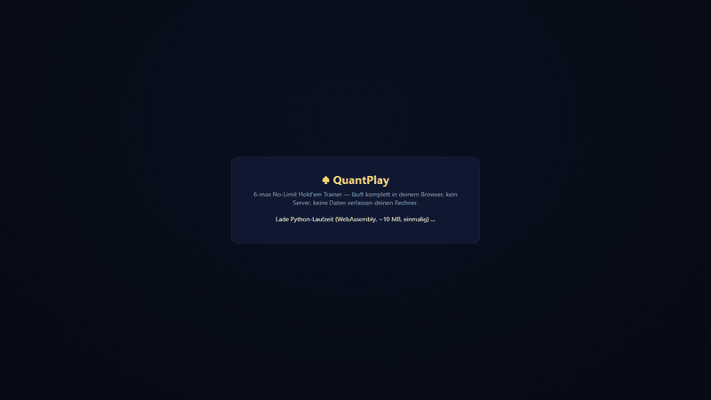

# QuantPlay

**A 6-max No-Limit Hold'em trainer that runs entirely in your browser, and the open, measured poker-bot
laboratory behind it.**

**▶ Play now: [quantplay.io](https://quantplay.io)** — no account, no install, no server. The Python engine
(~1.5 MB) is downloaded once and runs on *your* machine via WebAssembly. Your hands never leave your browser.



Every decision you make is graded within the hand against the engine's own line, with a written explanation
and the math behind it (pot odds, MDF, equity, solver frequencies). Five modes: **GTO**, **Exploit** (the bots
learn *you* live), **Arena** (rotating adaptive opponents), **Tournament** (60-player MTT with exact ICM) and
**Match** (no coaching, everything recorded for review). Details: [The trainer](#the-trainer).

---

## Why this repository is worth your time

- **It is a research project, published with its negative result.** The goal was a heads-up bot in the top 5
  of the GTO Wizard AI leaderboard. It was not reached; [`docs/PROJECT_BALANCE_2026-09-10.md`](docs/PROJECT_BALANCE_2026-09-10.md)
  says why, in detail. What remains is unusual: a bot whose every number has a source and a channel, two
  catalogues that document **272 modules and every measurement, including the ideas that were refuted**, and a
  measurement discipline that transfers to any noisy A/B problem.
- **The bot is strong on weak hardware.** It does not play perfectly (see the table below), but the whole
  engine — preflop blueprint, postflop math, solver-frequency advisors, the guard chain, the opponent league,
  the grader — decides in milliseconds on a single CPU core, needs no GPU and no ML framework to play, and runs
  in a phone's browser through Pyodide. The trainer's slowest request measured in the browser runtime is 0.35 s
  (tournament mode); a typical one is 0.1 s.
- **It is built to be worked on with AI agents.** Every module is described independently in the
  [module catalogue](docs/catalogs/MODULE_CATALOG.md) (purpose, interface, dependencies, measurement status, the one
  pitfall), the state is a dated log, the conventions are explicit (`CLAUDE.md`, `AGENTS.md`, `llms.txt`),
  the routes can be driven without HTTP, and the tests are plain `python -m` modules. A coding agent can pick
  any module and decide: reuse, rebuild, or skip — and it can see what was already tried and failed.

---

## The trainer

| Mode | What it trains |
|---|---|
| **GTO** | The league of profiled bots (TAG, LAG, nit, station, maniac, whale, shark, rock …) plays its baseline straight. Every decision is graded against the engine's own line with a written explanation. |
| **Exploit** | The bots build a live model of *you* and attack your leaks. You experience your own exploitability. |
| **Arena** | Rotating, adaptive opponent types across all stack depths. A stress test for staying disciplined. |
| **Tournament** | A 60-player MTT (6 tables × 10) with rising blinds, antes, table balancing, a final table and a top-9 payout. ICM hints appear once the bubble factor bites. Exact Malmuth-Harville ICM, tested against independent enumeration. |
| **Match** | Same opponents, no coaching, no distractions. Everything is recorded and graded for review afterwards. |

Plus: pre-fold while others still act (the hand is played out in the background and chips move correctly),
hand replay with per-decision grades, an opponent panel showing what the bots have learned about you, a
session analysis after ~100 hands, and a 61-entry glossary whose formulas are the audited ones in
[`knowledge_base/math/formulas.py`](knowledge_base/math/formulas.py).

### Run it locally

```bash
pip install -r requirements.txt
python -m pokerbot.web.six_server --trainer
```

Python 3.12, run from the repo root; the trainer is at `http://127.0.0.1:8000/training` (Windows launchers in
[`scripts/`](scripts/)). Bot decisions are local, instant and free; no LLM is involved in play.

### How the browser version works

[`web/`](web/) turns the *same* trainer into a static site. [`web/build.py`](web/build.py) zips the Python
package plus the knowledge files it reads at runtime; [`web/src/worker.js`](web/src/worker.js) boots
[Pyodide](https://pyodide.org) in a Web Worker, installs five pure-Python wheels and imports the trainer;
[`web/src/bridge.js`](web/src/bridge.js) replaces `fetch('/api/…')` so the unchanged front-end talks to the
worker instead of a server. The route dispatcher is
[`pokerbot/web/browser_bridge.py`](pokerbot/web/browser_bridge.py) (it calls the FastAPI endpoints directly,
because Pyodide has no threads for the ASGI threadpool). Measured in Node + Pyodide: import 0.9 s, five full hands
with grading 0.32 s, slowest request 0.11 s (tournament 0.35 s). Tests: [`tests/test_browser_bridge.py`](tests/test_browser_bridge.py).

```bash
python web/build.py                          # -> web/dist (deterministic, content-hashed)
python -m http.server 8765 --directory web/dist
```

---

## The bot, honestly

A heuristic engine (preflop blueprint from CFR push/fold + solver-distilled tables; postflop equity, pot odds,
MDF with solver-frequency advisors) wrapped in a chain of measured guards, a bounded exploit overlay, and
optional real-time re-solving (TexasSolver) at river/turn nodes. Every number below has a source in the
[measurement catalogue](docs/catalogs/MEASUREMENT_CATALOG.md); **the channel decides what a number means**.

| Measurement | Result | Channel / n | Meaning |
|---|---|---|---|
| Heads-up vs **GTO Wizard AI** (the only true GTO anchor) | **−21.1 ± 9.4 bb/100** (v4, AIVAT) | live API, n = 979 | 95 % band ≈ [−39.5, −2.7]. Leaderboard top: private bots at −3.1; best frontier LLM −9.2. The current champion (v5) was never anchored. |
| v5 vs its own base | +30.6 bb/100 | paired self-play mirror | A non-regression bound, **not** strength. Individual guard gains (~+53) did not add up. |
| Tournament risk premium (proportional bubble factor) | **+10.0 ± 5.0 pp ROI** | paired SNG arena, n = 1,500 | The full bubble factor was refuted (−8 pp); the proportional one validated. |
| vs **PokerSnowie** via the screen bridge | +3.2 bb/100 [−37, +44] | 3,114 clean hands of 3,651 | Break-even; the automation errors, not the bot, cost the account. |
| Kaggle Game Arena heads-up (LLM field, 100 bb) | −0.7 ± 2.5 bb/100 vs champion | paired, 150 decks | A cheap volume channel, not a GTO anchor. |
| Opponents who are not GTO | +300 … +700 bb/100 | local benchmark bots | The exploit layer works against exploitable play. |
| Decision latency | 83 ms (resolver off), ~6 s (river re-solve) | single CPU core | No GPU needed: an advisor micro-benchmark gained nothing from the GPU (3.20 vs 3.52 ms; launch and transfer eat the difference), so live inference stays on CPU. |

What was learned the hard way: guards around a heuristic engine hit an asymptote (≈ −10 predicted, never
reached); self-play gains do not transfer to a re-solver; the per-hand standard deviation is 294 bb, so a
±4 bb/100 answer costs ~5,400 hands; and a well-prompted frontier LLM plays heads-up better than this bot.
The **refuted** ideas are listed explicitly in the module catalogue — for anyone rebuilding, that is the most
valuable part.

## The measurement discipline (transferable beyond poker)

Everything the project trusts came from a small set of rules, all of them learned from being wrong first:

- **Paired evaluation cancels luck.** Both arms play the identical decks with seats swapped
  ([`pokerbot/benchmark/duplicate.py`](pokerbot/benchmark/duplicate.py), [`pokerbot/autogym/pargate.py`](pokerbot/autogym/pargate.py)).
- **A/A must be exactly zero** before any A/B: a candidate identical to the incumbent must show 0.0 — three
  hidden non-determinism bugs were found this way (RNG stream across hands, hand IDs per half, set iteration).
- **Pre-registered expectations, three-run rule, no naming before replication.** Two premature "wins" were
  stopped by it.
- **The channel is part of the number.** Self-play, analyzer grade, live anchor: they are not addable, and the
  catalogue says which is which.
- **Corrections are recorded, not overwritten.** The variance coefficient 214 → 294, two invalidated Kaggle
  runs, a stack-depth mismatch: all still in the catalogue with their consequences.

Reusable pieces: paired/duplicate harnesses, the A/A gate, the bootstrap verdicts (`stats.verdikt`), the
pre-registration templates in [`docs/catalogs/CANDIDATES.md`](docs/catalogs/CANDIDATES.md), and an exact ICM
implementation ([`pokerbot/strategy/icm.py`](pokerbot/strategy/icm.py)).

---

## Repository map

| Path | What |
|---|---|
| [`pokerbot/engine/`](pokerbot/engine/) | cards, evaluator (treys), Monte-Carlo equity, the N-player table (2–10 seats, side pots) |
| [`pokerbot/strategy/`](pokerbot/strategy/) | preflop blueprint, range tracker, postflop math, advisors, exploit model, ICM, tournament doctrine, the guard chain (`auslese.py`) |
| [`pokerbot/arena/`](pokerbot/arena/) | the opponent league (`sixmax.py`), MTT director, tournament arena |
| [`pokerbot/web/`](pokerbot/web/) | the trainer server (`six_server.py`), the UI (`static/training.html`), the serverless bridge |
| [`pokerbot/coach/`](pokerbot/coach/) | decision capture, grading oracle, feedback templates, replay, opponent panel, glossary |
| [`pokerbot/autogym/`](pokerbot/autogym/) | the self-improving loop: math oracle, paired gyms, gates, journal |
| [`pokerbot/benchmark/`](pokerbot/benchmark/) | GTO Wizard, Slumbot, Kaggle Game Arena harnesses, duplicate/paired evaluation |
| [`pokerbot/brain/`](pokerbot/brain/) | the engine as a typed API for programs (`api.py`), canonical spot format, the LLM-brain experiments |
| [`pokerbot/vision/`](pokerbot/vision/) | the PokerSnowie screen bridge (template matching, state gates, marathon guard) |
| [`knowledge_base/`](knowledge_base/) | extracted, structured knowledge: audited formulas, ranges, concepts, exploit playbook |
| [`web/`](web/) | the static browser build of the trainer (quantplay.io) |
| [`docs/`](docs/) | [`STATE.md`](docs/STATE.md) · [`catalogs/`](docs/catalogs/) (modules, measurements, candidates, data) · [`doctrine/`](docs/doctrine/) · [`plans/`](docs/plans/) · [`reports/`](docs/reports/) · [`consults/`](docs/consults/) (LLM consult transcripts) · [`archive/`](docs/archive/) |
| [`research/`](research/) | one-off measurement and mining scripts (`python -m research.<name>`) |
| [`tests/`](tests/) | `python -m tests.test_table`, `test_bot`, `test_icm`, `test_tournament`, `test_prefold`, `test_browser_bridge` … |
| [`scripts/`](scripts/) | Windows launchers |

For AI agents: [`AGENTS.md`](AGENTS.md) (how to work here), [`llms.txt`](llms.txt) (machine-readable map),
[`CLAUDE.md`](CLAUDE.md) (full conventions and doctrine). Cite via [`CITATION.cff`](CITATION.cff).

## License

**[PolyForm Noncommercial 1.0.0](LICENSE.md).** Use, copy, modify and share everything here for noncommercial
purposes: personal study, research, teaching, hobby projects, noncommercial organizations. **Any commercial use
— selling, running as a paid service, using the bot, trainer, ranges, knowledge base or measurements inside a
commercial product or to make money at the tables for a business — requires written permission** from
Leonhard Hampe (open a GitHub issue). Keep the [`NOTICE`](NOTICE) file with every copy.

## Status

Closed as a leaderboard race on 2026-09-10; published and kept alive as a trainer and a reference on 2026-09-24.
Large artifacts (solver caches, trained nets, LLM checkpoints, hand histories) and the source books are not in
the repository. Most documentation was translated from German; code comments are partly still German.
